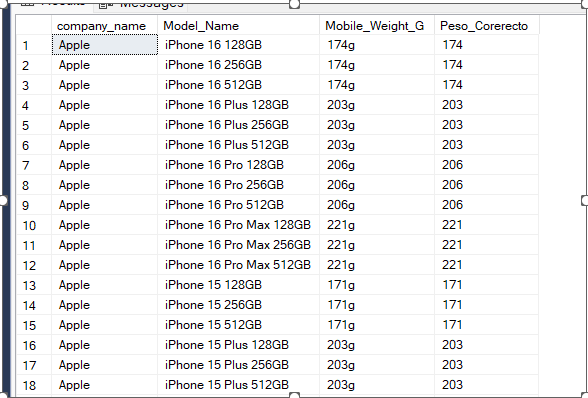
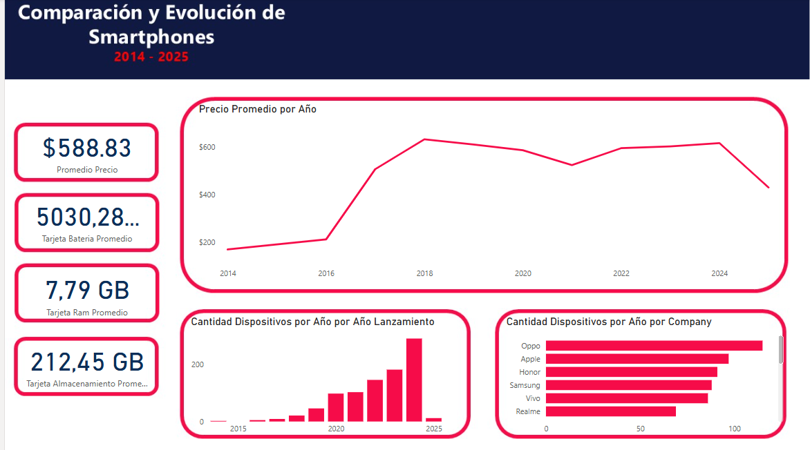
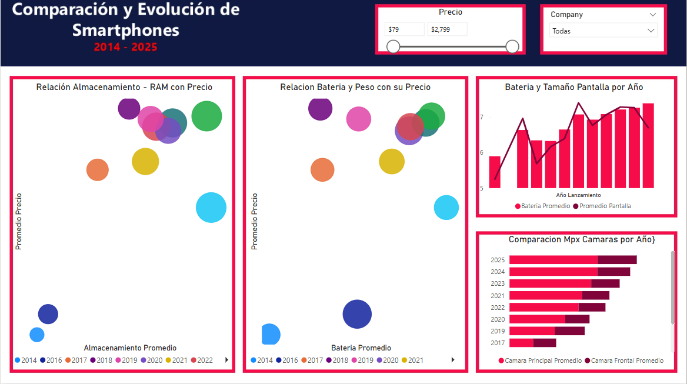
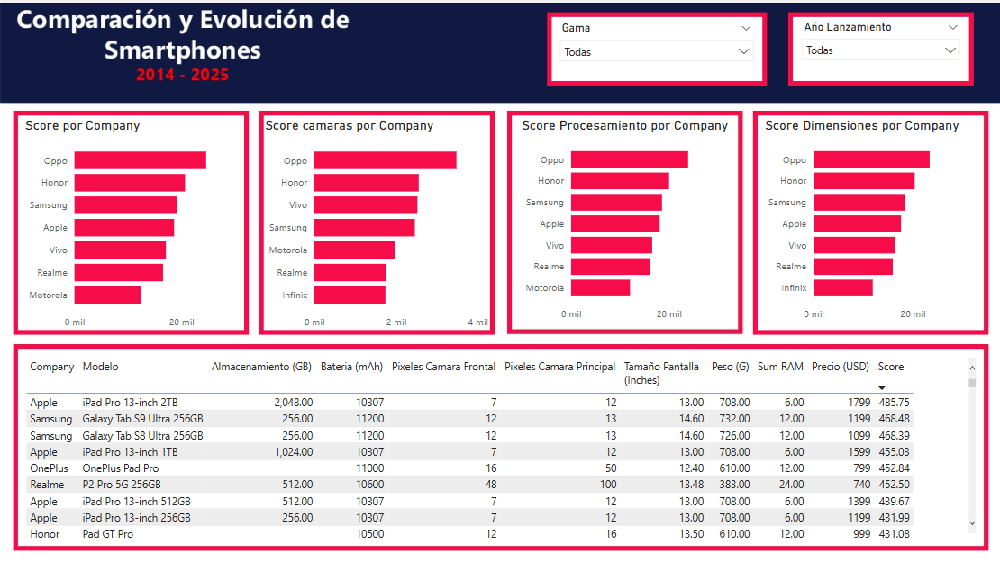

# Project 1 - Smartphones


## Overview
Hi! In this project I'm analyzing a Dataset about Smartphones that i Found on Kaggle Platform.
My goal with this project is to practice the use of CTE's and some data cleansing using SQL, as well as to develop a small interactive dashboard in Power BI that allows to analyze some characteristics of cell phones over time.


## Objectives
  -  Use SQL Functions to remove characters on Numerical Data
  -  Analyze the relationship between prices and features.
  -  Based on a Score of the models to see which phone is more accurate for my needs.

## Data Set
This Data Set is from Kaggle, you can find the original DataSet here:
https://www.kaggle.com/datasets/abdulmalik1518/mobiles-dataset-2025
- **Dataset Link:** [Mobiles Dataset 2025](https://www.kaggle.com/datasets/abdulmalik1518/mobiles-dataset-2025)

## Data Cleaning SQL
For this Part I Import the data using the SQL Developer Tool, so the program created the table with NVARCHAR to all the columns.


###   1.Creating Second Table
I started to create a second table to start making changes, using a CTAS, deleting some columns and to have a backup of the original information in case I made a mistake.
```sql
SELECT company_name,
       model_name,
       mobile_weight    AS Mobile_Weight_G,
       ram              AS RAM_GB,
       front_camera     AS Front_Camera_Mpx,
       back_camera      AS Back_Camera_Mpx,
       processor,
       battery_capacity AS Battery_Capacity_mAh,
       screen_size      AS Screen_Size_Inches,
       launched_price_usa,
       launched_year
INTO   cellphone2
FROM   cellphone;
```
     
  ### 2. Duplicate Rows
  I use the next Query to valide if there was a Duplicate rows using CTE's and ROW_NUMBER Function, i found a couple of duplcate phone models, so using the same querie swithcing between select and delete instrucition.
  
  ```sql
WITH duplicados
     AS (SELECT *,
                Row_number()
                  OVER(
                    partition BY company_name, model_name, ram_gb, processor,
                  battery_capacity_mah, launched_year
                    ORDER BY company_name) AS Repetido
         FROM   cellphone2)
DELETE FROM duplicados
WHERE  repetido > 1;

SELECT *
FROM   duplicados
WHERE  repetido > 1 
  ```

### 3. Removing Text
Most of the columns had some word to specify the measurement they were using, for example, to describe the RAM of the device they use “8 GB” or for Height Size they use “9 Inches”, I have removed the measurement indicator, to use these metrics as Numerical Data.

I use CTE's and some Text SQL function to remove the measurement indicator, with the CHARINDEX Function I found the Indicator and from then extract the text usign SUBTSTING Function or Left or Right depend on the case.

** Example G Measurment**
```sql
WITH valor_correcto
     AS (SELECT company_name,
                model_name,
                mobile_weight_g,
                Substring(mobile_weight_g, 1, Len(mobile_weight_g) - 1) AS
                   Peso_Corerecto
         FROM   cellphone2)
SELECT *
FROM   valor_correcto;
--Update valor_correcto set Mobile_Weight_G = Peso_Corerecto;
 ```


**Example GB Measurment**
```sql
WITH valor_correcto AS
(
       SELECT company_name,
              model_name,
              ram_gb,
              substring(ram_gb,1,len(ram_gb)-2) AS ram_correcta
       FROM   cellphone2 )
--Select * from valor_correcto;
--Update valor_correcto set RAM_GB = RAM_correcta;
 ```



**MPX Indicator**

To eliminate this indicator, I use a Case structure and the ISNUMERIC function, I take the first 3 values with the LEFT function, if these 3 values are numeric (Example: 128, 200) I use these values, but if the first 3 values are not numeric (Example: 64M, 12M), I use the same LEFT function to take the first 2 values.
```sql
WITH valores_correctos
     AS (SELECT company_name,
                model_name,
                back_camera_mpx,--isnumeric(LEFT(back_Camera_Mpx,3)) AS PRUEBA,
                CASE --Front_Camera_Mpx  
                  WHEN Isnumeric(LEFT(back_camera_mpx, 3)) = 1 THEN
                  LEFT(back_camera_mpx, 3)
                  WHEN Isnumeric(LEFT(back_camera_mpx, 3)) = 0 THEN
                  LEFT(back_camera_mpx, 2)
                END AS Camara_Correcta
         FROM   cellphone2)
--Update valores_correctos set back_Camera_Mpx = Camara_Correcta;
SELECT *
FROM   valores_correctos; 
 ```

The rest of the Coluns had the same logic

### 4. Add Storage Column

In this case, I followed the same logic as the Camera, I found the text “GB” and took the 2 or 3 characters on the left depending on whether they were greater than 100

```sql
-- Add new Column
ALTER TABLE cellphone2
  ADD almacenamientogb NVARCHAR(50)

Create Data
WITH nc
     AS (SELECT model_name,
                CASE
                  WHEN Charindex('GB', model_name) > 0 THEN Trim(
                  Substring(model_name, Charindex('GB', model_name) - 3, 3))
                  WHEN Charindex('GB', model_name) = 0 THEN model_name
                END AS Almacenamiento,
                almacenamientogb
         --SUBSTRING(model_name,CHARINDEX('GB', Model_Name)-3,3),
         --CHARINDEX('GB', Model_Name), LEN(model_name), left(Model_Name,5) 
         FROM   cellphone2)
SELECT *
FROM   nc
WHERE  Isnumeric(almacenamientogb) = 0;
--Update nc set AlmacenamientoGB = Almacenamiento;
 ```

### 5. Export Data

In this step I only update the values using the TRIM Function to remove spaces, and exported to a CSV File
 ```sql
UPDATE cellphone2
SET    ram_gb = Trim(ram_gb),
       front_camera_mpx = Trim(front_camera_mpx),
       back_camera_mpx = Trim(back_camera_mpx),
       battery_capacity_mah = Trim(battery_capacity_mah),
       screen_size_inches = Trim(screen_size_inches),
       launched_price_usa = Trim(launched_price_usa);
 ```
## Data Visualization - POWER BI
I did not use very complicated DAX functions yet, just the creation of the basic measurements for each specification and some that I will show below.


### Transform Data

I didn't do much in this part, the only thing I modified with Power Query was to add a new column to separate in ranges the models according to their prices in the following ranges

  -  Gama Baja (Under $200)
  -  Gama Media (Under ($500)
  -  Gama Alta (Unuder $1000)
  -  Gama Premium (Everything Else)

```dax
Gama =
SWITCH (
    TRUE (),
    'Cellphone_v2 (2)'[Precio USD] <= 200, "Gama Baja",
    'Cellphone_v2 (2)'[Precio USD] <= 550, "Gama Media",
    'Cellphone_v2 (2)'[Precio USD] <= 1000, "Gama Alta",
    'Cellphone_v2 (2)'[Precio USD] > 1000, "Gama Premium"
)
 ```

And convert some Storage to GB, because some of the rows had TB instead of GB, so muktiply those to 1024. 

### Visualizations

I Build 3 Pages with different visualiaztions,

1. General Information: In this page, I put some general information about the Data Set, such as the number of Smartphones per year and per Company, and some Cards with the average specifications. And the Average Price per Year.

I created this type of Measures on DAX to concatenate the indicador in the Card
 ```dax
Tarjeta Almacenamiento Promedio = CONCATENATE(FORMAT([Almacenamiento Promedio],"Fixed"), " GB")
 ```


2. Specifications: This page shows some relationships between specifications. 
I made 2 scatter plots, one to show the relationship betweem price and average storage. Higher prices and newer models indicate that the phone would have more RAM and storage, but it is interesting to see how between 2019 and 2023 the smartphones had similar prices and similar storage, and in 2024 the prices increased and so did the average storage. 

In the second shows the relationship between the price of the cell phone and its weight and battery capacity, the more expensive and the heavier the cell phone tends to have more battery and heavier, although from the year 2022 the values are more similar. 

The other two graphs show how the number of megapixels in the cameras has been increasing the more modern they are and the increase of battery and screen over the years.



3. Score: In the third sheet I assigned a Score according to my tastes in cell phones with the following formula in DAX assigning a weight to each specification
```dax
Score =
SUMX (
    'Cellphone_v2 (2)',
    'Cellphone_v2 (2)'[Ram] * 3 + 'Cellphone_v2 (2)'[Almacenamiento] * 3 + 'Cellphone_v2 (2)'[Bateria mAh] * 4 + 'Cellphone_v2 (2)'[MPX Camara Trasera] * 5 + 'Cellphone_v2 (2)'[MPX Caramara Frontal] * 2.5 + 'Cellphone_v2 (2)'[Peso] * 1.5 + 'Cellphone_v2 (2)'[Pantalla] * 3.5
) / 100
```

This shows the companies that would have cell phone models that fit more to what I like.

I did the same with cameras, device dimensions (Weight and Size) and Processing (Storage and Ram).



## Conclusion
It was interesting to see how after a certain year some specifications become “stagnant” in that they no longer increase significantly in value, I also found it interesting how OPPO turns out to be a brand that could be in line with my tastes in cell phones.
